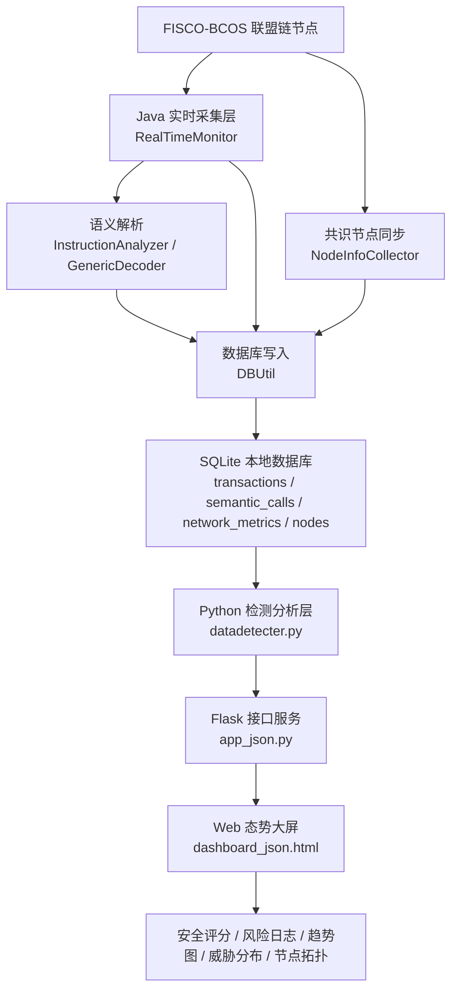
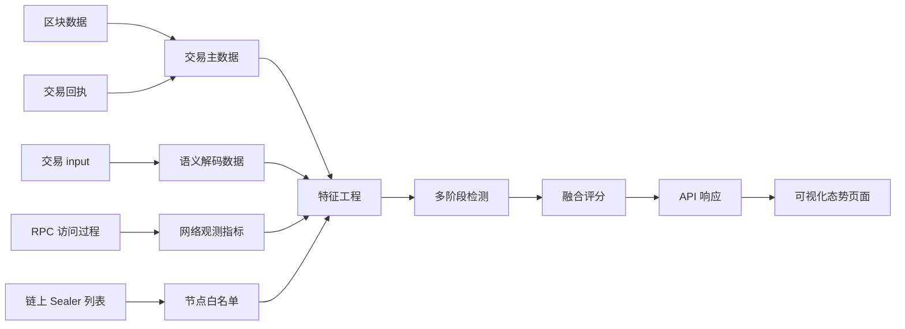
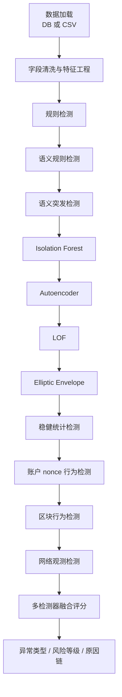
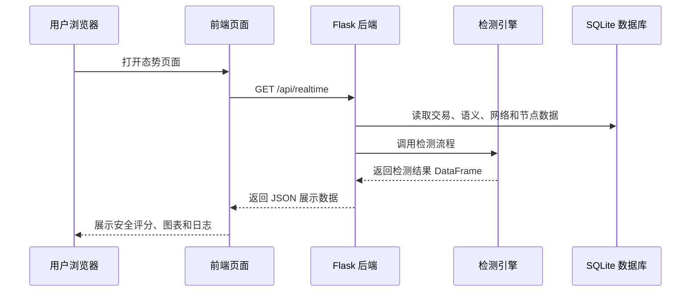

# FISCO-BCOS 联盟链安全防御平台 V1.0 软件说明书

| 项目 | 内容 |
| --- | --- |
| 软件名称 | FISCO-BCOS 联盟链安全防御平台 |
| 版本号 | V1.0 |
| 文档名称 | FISCO-BCOS 联盟链安全防御平台 V1.0 软件说明书 |
| 著作权人 | 待填写 |
| 开发完成日期 | 待填写 |
| 文档版本 | V1.0 |
| 文档用途 | 软件著作权登记说明材料、项目讲解材料、系统展示材料 |

## 文档说明

本文档按照软件著作权登记说明书的常用写法编写，用于说明“FISCO-BCOS 联盟链安全防御平台 V1.0”的软件定位、运行环境、总体架构、数据结构、功能模块、安全检测方法、接口数据流、操作流程、异常处理和应用价值。文档内容基于当前工程实际实现编写，重点对应 Java 链上数据采集模块、Python 检测分析模块、SQLite 数据存储模块、Flask 接口服务模块和前端态势展示模块。

根据《计算机软件著作权登记办法》的公开要求，软件著作权登记通常需要提交软件著作权登记申请表、软件鉴别材料和相关证明文件。其中，软件鉴别材料包括源程序和文档材料，源程序和文档通常由前、后各连续 30 页组成；不足 60 页的，提交全部源程序和文档。除特定情况外，源程序每页不少于 50 行，文档每页不少于 30 行。正式提交时，应以实际办理机构要求为准。

本文档统一使用“FISCO-BCOS 联盟链安全防御平台 V1.0”作为软件名称和版本口径。后续申请表、说明书、源程序材料、页眉页脚和项目介绍中应保持名称、版本号、著作权人和开发完成日期一致。

---

# 目录

1. 引言
2. 软件概述
3. 运行环境
4. 系统总体架构
5. 数据结构设计
6. 功能模块说明
7. 安全检测方法说明
8. 接口与数据流说明
9. 软件操作说明
10. 异常处理与运行维护
11. 软件特点与应用价值
12. 源程序材料整理建议
13. 附录：项目文件对应关系

---

# 1. 引言

## 1.1 编写目的

本文档用于对“FISCO-BCOS 联盟链安全防御平台 V1.0”进行完整的软件说明。文档从软件功能、系统架构、数据结构、运行流程和安全检测能力等角度，描述平台的设计目标、组成模块、使用方式和应用价值，为软件著作权登记、系统交付、项目答辩、教学演示和后续维护提供统一依据。

本平台面向 FISCO-BCOS 联盟链运行场景，围绕链上区块、交易、交易回执、共识节点、合约调用语义、账户行为和网络观测指标进行统一采集、存储、分析和展示，形成从链上数据接入到安全风险展示的完整闭环。文档中的功能描述均以当前工程实际实现为基础，不虚构用户登录、权限审批、多租户管理、攻击自动处置、链上合约自动修复等当前代码中未实现的能力。

## 1.2 软件定位

FISCO-BCOS 联盟链安全防御平台 V1.0 是一套面向联盟链运行安全的防御监测与态势感知软件。平台以 FISCO-BCOS Java SDK 为链上数据接入基础，以 SQLite 为本地运行数据存储介质，以 Python 检测引擎为安全分析核心，以 Flask 接口服务和 Web 可视化页面为展示入口，实现对联盟链运行状态和安全风险的集中管理。

平台重点解决以下问题：

1. 联盟链运行数据分散，缺少统一采集和结构化管理能力。
2. 链上交易、区块、合约调用、节点和网络指标之间缺少关联分析能力。
3. 单一规则检测容易漏报或误报，缺少多维检测与融合评分能力。
4. 安全结果难以直观展示，运维人员不易快速了解整体风险态势。
5. 历史数据回溯和实验数据分析缺少统一入口。

## 1.3 适用对象

本软件适用于以下用户和场景：

| 适用对象 | 使用目的 |
| --- | --- |
| 联盟链节点运维人员 | 查看链上区块、交易、节点和网络运行状态 |
| 安全监测人员 | 识别异常交易、异常区块、异常节点和异常账户行为 |
| 安全审计人员 | 基于检测结果和原因链进行风险复盘 |
| 区块链开发人员 | 验证 FISCO-BCOS 链上数据采集和接口展示流程 |
| 教学实验人员 | 演示联盟链安全态势感知、多模型检测和可视化分析流程 |
| 项目评审人员 | 了解平台的系统组成、功能边界和核心实现方式 |

## 1.4 应用场景

平台可用于 FISCO-BCOS 联盟链环境下的运行监控、安全分析、异常预警和历史回溯。典型应用场景包括：

1. **实时安全态势监控**：持续获取链上新区块和交易，将采集数据写入本地数据库，并通过前端页面展示安全评分、交易流、威胁分布和风险日志。
2. **链上交易异常检测**：基于交易 Gas、input 长度、状态码、nonce、区块交易量等特征，识别可疑交易和异常行为。
3. **合约调用风险识别**：对交易 input 数据进行语义解码，识别合约部署、普通转账、函数调用、敏感函数和未知函数调用。
4. **共识节点白名单校验**：从链上动态同步共识节点白名单，对非白名单节点产生的可疑区块或交易进行识别。
5. **账户行为分析**：按发送方账户分析 nonce 序列，发现 nonce 回退、大跳变和异常比例较高的账户行为。
6. **网络状态观测**：记录 RPC 延迟、区块间隔和区块失败率，辅助判断网络压力和链上异常之间的关联。
7. **历史 CSV 离线分析**：上传历史数据文件，由检测引擎进行特征构建和风险检测，支持离线复盘和实验验证。

## 1.5 术语说明

| 术语 | 说明 |
| --- | --- |
| FISCO-BCOS | 面向联盟链场景的区块链底层平台 |
| 联盟链 | 由多个授权节点共同维护的许可型区块链网络 |
| Sealer | FISCO-BCOS 中参与共识和出块的节点 |
| 区块 | 区块链中按顺序组织交易和元数据的数据单元 |
| 交易回执 | 交易执行后的结果信息，包含状态码、Gas 消耗等 |
| input_data | 交易输入数据，可包含合约调用方法 ID 和参数 |
| method_id | 合约函数选择器，用于识别调用的函数 |
| nonce | 交易序列相关字段，可用于账户行为分析 |
| Isolation Forest | 一种基于随机划分的异常检测算法 |
| LOF | Local Outlier Factor，局部离群因子检测方法 |
| Autoencoder | 自编码器重构误差异常检测方法 |
| Elliptic Envelope | 基于协方差估计的异常检测方法 |
| SQLite | 本地轻量级关系数据库 |
| Flask | Python Web 服务框架 |
| ECharts | 前端图表展示库 |

---

# 2. 软件概述

## 2.1 建设背景

随着联盟链在政务、金融、供应链、数据可信流转等场景中的应用增加，链上交易规模、合约调用频率和节点运行复杂度不断提升。联盟链系统虽然具有准入控制、节点授权和共识机制等基础安全能力，但在实际运行过程中仍可能面临交易异常、合约调用异常、共识节点异常、账户行为异常和网络压力异常等问题。

传统人工查询链上信息或查看节点日志的方式，难以及时发现跨维度的运行风险。例如，一笔交易可能单独看 Gas 消耗并不明显异常，但结合 input 长度、执行状态、合约方法、区块交易量和账户 nonce 序列后，可能呈现出更高风险。单一检测规则也难以覆盖复杂的联盟链运行场景，因此需要构建一套能够统一采集链上数据、进行多维特征分析、执行多阶段检测并将结果可视化展示的软件平台。

FISCO-BCOS 联盟链安全防御平台 V1.0 正是在上述需求下设计和实现的。平台以链上实时采集为基础，以多检测器融合为核心，以态势展示为输出方式，为联盟链运行管理和安全防御提供软件支撑。

## 2.2 建设目标

平台建设目标包括：

1. **链上数据实时采集**：基于 FISCO-BCOS Java SDK 获取区块、交易和交易回执信息，形成可持续运行的数据接入能力。
2. **运行数据结构化存储**：将交易数据、语义解码数据、网络指标和节点白名单写入 SQLite 数据库，便于后续检测分析。
3. **合约调用语义解析**：对交易 input 数据进行分类和解析，识别部署交易、普通转账、函数调用和敏感操作。
4. **多维安全检测分析**：综合规则检测、统计检测、机器学习检测、行为检测、语义检测和网络检测，提高风险识别覆盖面。
5. **风险融合和等级评估**：通过检测器命中记录、加权评分和投票机制，输出统一风险等级、异常类型和原因链。
6. **实时与离线双模式支持**：既支持读取数据库实时检测，也支持导入 CSV 历史数据进行离线分析。
7. **可视化态势展示**：通过 Web 页面展示安全评分、趋势图、威胁分布、节点拓扑、实时交易和风险日志。
8. **可维护运行方式**：提供配置文件、启动命令、接口入口和异常处理说明，便于部署和维护。

## 2.3 软件总体功能

平台总体功能包括链上连接管理、实时数据采集、数据库管理、语义分析、白名单同步、安全检测、接口服务和可视化展示。

| 功能类别 | 功能说明 |
| --- | --- |
| 链上连接 | 读取 FISCO-BCOS SDK 配置，连接指定 group |
| 区块采集 | 获取区块高度、区块交易列表和交易详情 |
| 交易回执采集 | 获取交易执行状态和 Gas 消耗 |
| 数据入库 | 写入交易主数据、语义结果和网络指标 |
| 节点白名单 | 同步链上 Sealer 节点列表并写入 `nodes` 表 |
| 语义解析 | 识别部署、转账、函数调用、方法 ID 和参数摘要 |
| 规则检测 | 检测 Gas、input、状态码、节点和 Gas 比例异常 |
| 模型检测 | 使用 Isolation Forest、LOF、Elliptic Envelope 和 Autoencoder |
| 行为检测 | 检测账户 nonce、区块交易突发和失败风暴 |
| 网络检测 | 检测 RPC 延迟、区块间隔和失败率异常 |
| 结果融合 | 输出异常类型、风险分数、风险等级和原因链 |
| 实时 API | 输出实时检测结果和图表数据 |
| CSV 分析 | 支持上传历史 CSV 文件执行离线检测 |
| 前端展示（Flask 大屏） | 展示安全评分、趋势图、威胁分布、节点拓扑和日志 |
| 前端展示（Streamlit 仪表盘） | 展示威胁总览指标、威胁类型饼图、趋势柱状图、高频账户和威胁列表 |

## 2.4 软件特点概述

平台具有以下特点：

1. **面向 FISCO-BCOS 联盟链场景**：围绕联盟链节点、区块、交易、合约调用和共识节点建立数据采集与分析流程。
2. **采集、检测、展示闭环完整**：从链上数据采集到检测结果展示形成闭环，便于运行演示和实际监控。
3. **实时检测和历史分析并行**：支持数据库实时分析，也支持 CSV 历史数据导入。
4. **规则与模型融合**：硬规则用于识别高置信异常，机器学习和统计方法用于识别复杂离群模式。
5. **语义与网络特征扩展**：除交易基础字段外，还关联合约方法语义和网络观测指标。
6. **风险结果可解释**：输出异常类型、风险等级、融合分、投票数和原因链，便于后续审计。
7. **部署结构轻量**：采用本地 SQLite、Flask 服务和静态前端页面，适合实验、演示和中小规模部署。

---

# 3. 运行环境

## 3.1 硬件环境

本软件可部署在普通开发主机或服务器环境中。推荐硬件环境如下：

| 硬件项 | 推荐配置 |
| --- | --- |
| CPU | 双核及以上处理器 |
| 内存 | 8 GB 及以上 |
| 磁盘 | 20 GB 及以上可用空间 |
| 网络 | 可访问 FISCO-BCOS 节点的网络环境 |

如果链上交易量较大，建议提升 CPU、内存和磁盘配置，并将 SQLite 替换或扩展为更适合持续写入的数据库系统。当前版本以实验和演示场景为主，默认采用 SQLite 存储。

## 3.2 操作系统环境

平台可运行于支持 Java、Maven 和 Python 的操作系统，包括：

1. Windows 10/11。
2. macOS。
3. Linux 发行版，如 Ubuntu、CentOS、Debian 等。

实际部署时，需要保证系统能够访问 FISCO-BCOS 节点 IP 和端口，并确保证书路径、配置文件路径和本地数据库路径正确。

## 3.3 软件依赖环境

平台主要依赖如下：

| 类型 | 依赖 |
| --- | --- |
| Java 环境 | Java 11 及以上 |
| 构建工具 | Maven |
| 区块链 SDK | FISCO-BCOS Java SDK 3.7.0 |
| Python 环境 | Python 3.10 及以上 |
| Python Web | Flask、Flask-CORS |
| Python 可视化 | Streamlit、Plotly（仪表盘方案） |
| Python 数据处理 | pandas、numpy |
| Python 机器学习 | scikit-learn |
| 数据库 | SQLite |
| 前端库 | Vue、ECharts、Axios |

Python 依赖安装示例：

```bash
pip install flask flask-cors pandas numpy scikit-learn streamlit plotly
```

Java 依赖通过 Maven 的 `pom.xml` 管理，主要包括 FISCO-BCOS Java SDK、SQLite JDBC、日志组件和相关工具库。

## 3.4 区块链底层环境

平台需要连接可访问的 FISCO-BCOS 联盟链节点。配置文件通常包含证书路径、链节点地址、group 信息、连接超时时间和账户配置等内容。

部署时应注意：

1. `config.toml` 中的 `certPath` 应指向实际 SDK 证书目录。
2. `peers` 应配置为实际可访问的 FISCO-BCOS 节点地址和端口。
3. `defaultGroup` 应与链上实际 group 保持一致。
4. SDK 证书文件应妥善保管，不应写入公开说明文档正文。
5. 不应将私钥、真实生产节点凭据或敏感网络信息提交到公开材料中。

## 3.5 浏览器环境

可视化页面通过浏览器访问。推荐浏览器如下：

1. Chrome。
2. Microsoft Edge。
3. Firefox。
4. Safari。

浏览器需支持现代 JavaScript、CSS 和本地网络访问能力。默认访问地址为 Flask 服务地址，例如：

```text
http://127.0.0.1:5000
```

---

# 4. 系统总体架构

## 4.1 总体设计思路

FISCO-BCOS 联盟链安全防御平台 V1.0 采用“数据采集、数据存储、检测分析、展示服务”的分层设计方式。Java 模块负责与 FISCO-BCOS 链交互并采集数据，SQLite 负责本地结构化存储，Python 检测引擎负责特征工程和安全分析，Flask 后端负责接口封装，Web 前端负责态势展示。

该架构将链上访问、检测计算和页面展示分离，便于模块维护和功能扩展。实时采集程序可以持续运行，后端服务可以按需读取数据库进行分析，前端页面通过接口获取最新检测结果。

## 4.2 系统架构图



## 4.3 架构分层说明

| 架构层 | 主要职责 | 对应实现 |
| --- | --- | --- |
| 数据采集层 | 连接链节点、获取区块、交易、回执和共识节点信息 | `RealTimeMonitor.java`、`NodeInfoCollector.java` |
| 数据存储层 | 建表、写入交易数据、语义结果、网络指标和节点白名单 | `DBUtil.java`、SQLite |
| 检测分析层 | 特征构建、规则检测、机器学习检测、行为检测、融合评分 | `datadetecter.py` |
| 展示服务层 | 提供实时 API、CSV 导入 API、白名单刷新 API 和可视化页面（Flask 大屏与 Streamlit 仪表盘双方案） | `app_json.py`、`dashboard_json.html`、`dashboard.py` |

## 4.4 核心协同流程

平台核心协同流程如下：

1. 实时采集程序读取 FISCO-BCOS SDK 配置，连接指定 group。
2. 采集程序获取最新块高，从指定区块开始追赶并持续处理新区块。
3. 对每个区块，系统获取交易列表、交易详情和交易回执。
4. 系统提取交易哈希、区块号、发送方、接收方、状态码、Gas、nonce、input 等字段。
5. 语义分析模块对 input 数据进行调用类型和方法解析。
6. 数据库模块写入交易主数据、语义解码数据和网络观测指标。
7. 共识节点同步模块获取 Sealer 白名单并写入节点表。
8. 检测引擎读取数据库数据，关联语义特征、网络特征和节点白名单。
9. 检测引擎执行规则、统计、模型、行为、语义和网络检测。
10. 融合模块计算风险评分、风险等级和原因链。
11. Flask 后端将检测结果封装为前端可使用的 JSON 数据。
12. 前端大屏展示实时交易、安全评分、威胁分布、趋势曲线和节点拓扑。

## 4.5 数据流图



## 4.6 设计边界

当前版本定位为安全防御监测与态势感知平台，主要提供数据采集、风险识别、结果展示和历史分析能力。当前版本不包含以下功能：

1. 用户注册登录和角色权限管理。
2. 多租户组织管理。
3. 自动阻断交易或自动修复合约。
4. 多链跨链治理。
5. 生产级告警推送通道。
6. 完整安全运营工单系统。

这些内容可作为后续版本扩展方向，但不写入当前版本核心功能，避免说明书与实际代码不一致。

---

# 5. 数据结构设计

## 5.1 数据库总体说明

当前版本使用 SQLite 数据库存储运行数据。数据库文件默认位于项目根目录，文件名为：

```text
blockchain_data.db
```

数据库主要包含四类表：

1. `transactions`：交易主数据表。
2. `semantic_calls`：合约调用语义数据表。
3. `network_metrics`：网络观测指标表。
4. `nodes`：共识节点白名单表。

其中 `transactions`、`semantic_calls` 和 `network_metrics` 由数据采集和数据库工具模块写入；`nodes` 由共识节点同步模块写入。检测引擎读取这些表，并在内存中完成特征工程和风险分析。

## 5.2 交易主数据表 transactions

`transactions` 表用于存储链上交易的核心字段，是安全检测和态势展示的主要数据来源。

| 字段 | 类型 | 含义 | 来源 | 用途 |
| --- | --- | --- | --- | --- |
| id | INTEGER | 自增主键 | 数据库生成 | 数据排序和查询 |
| tradehash | TEXT | 交易哈希 | 链上交易详情 | 唯一标识交易 |
| blocknumber | INTEGER | 区块高度 | 区块数据 | 区块聚合分析 |
| sealer | TEXT | 打包节点 | 区块信息 | 共识节点校验 |
| from_addr | TEXT | 发送方地址 | 交易详情 | 账户行为分析 |
| to_addr | TEXT | 接收方地址 | 交易详情 | 合约或接收方分析 |
| timestamp | INTEGER | 区块时间戳 | 区块信息 | 时间序列分析 |
| status | TEXT | 交易执行状态 | 交易回执 | 失败交易检测 |
| input_data | TEXT | 交易输入数据 | 交易详情 | 语义解码和长度检测 |
| block_trade_count | INTEGER | 区块交易数量 | 区块交易列表 | 区块突发检测 |
| gas_limit | TEXT | 交易 Gas 限制 | 交易详情 | Gas 比例分析 |
| gas_used | INTEGER | 实际 Gas 消耗 | 交易回执 | Gas 异常检测 |
| nonce | TEXT | 交易 nonce | 交易详情 | 账户序列行为分析 |
| is_anomaly | INTEGER | 异常标记 | 预留字段 | 后续扩展 |
| risk_score | REAL | 风险分数 | 预留字段 | 后续扩展 |

该表支撑交易查询、趋势统计、规则检测、机器学习检测、账户行为检测和前端实时交易展示。

## 5.3 合约调用语义表 semantic_calls

`semantic_calls` 表用于保存交易 input 的语义解析结果，帮助平台从合约调用角度识别风险。

| 字段 | 类型 | 含义 | 来源 | 用途 |
| --- | --- | --- | --- | --- |
| id | INTEGER | 自增主键 | 数据库生成 | 数据排序 |
| tradehash | TEXT | 交易哈希 | 交易主数据 | 与交易表关联 |
| blocknumber | INTEGER | 区块高度 | 交易主数据 | 区块维度聚合 |
| contract_addr | TEXT | 合约地址 | 交易接收方 | 合约调用分析 |
| from_addr | TEXT | 调用方地址 | 交易发送方 | 调用主体分析 |
| call_type | TEXT | 调用类型 | 语义解析 | 区分部署、转账、函数调用 |
| method_id | TEXT | 函数方法 ID | input 解析 | 识别函数选择器 |
| method_name | TEXT | 函数名称 | 语义映射 | 展示和检测 |
| is_sensitive | INTEGER | 是否敏感函数 | 规则标记 | 敏感调用检测 |
| decode_success | INTEGER | 是否解码成功 | 解析结果 | 解码失败检测 |
| arg_summary | TEXT | 参数摘要 | 参数解析 | 风险证据展示 |
| created_at | INTEGER | 记录时间 | 系统时间 | 运行追踪 |

该表用于支撑合约调用识别、敏感函数检测、未知函数大载荷检测、语义解码失败检测和函数调用突发检测。

## 5.4 网络观测指标表 network_metrics

`network_metrics` 表用于记录采集区块过程中的网络和区块级指标。

| 字段 | 类型 | 含义 | 来源 | 用途 |
| --- | --- | --- | --- | --- |
| id | INTEGER | 自增主键 | 数据库生成 | 数据排序 |
| blocknumber | INTEGER | 区块高度 | 区块处理流程 | 与交易表关联 |
| rpc_latency_ms | INTEGER | RPC 延迟毫秒数 | 区块拉取耗时 | 网络压力检测 |
| block_interval_ms | INTEGER | 区块间隔毫秒数 | 相邻区块时间戳 | 出块波动检测 |
| tx_count | INTEGER | 区块交易数 | 区块交易列表 | 区块负载观测 |
| fail_rate | REAL | 区块失败率 | 交易状态统计 | 失败风暴检测 |
| created_at | INTEGER | 记录时间 | 系统时间 | 运行追踪 |

该表用于支撑网络异常检测、区块间隔异常检测、区块失败率分析和前端趋势展示。

## 5.5 共识节点白名单表 nodes

`nodes` 表用于保存链上同步得到的 Sealer 节点白名单。

| 字段 | 类型 | 含义 | 来源 | 用途 |
| --- | --- | --- | --- | --- |
| node_id | TEXT | 节点 ID | 链上 Sealer 列表 | 节点身份校验 |
| role | TEXT | 节点角色 | 同步模块写入 | 区分 Sealer 等角色 |
| update_time | LONG | 更新时间 | 系统时间 | 白名单更新追踪 |

检测引擎优先从 `nodes` 表读取共识节点白名单。如果数据库白名单不可用，则使用静态配置作为回退。该机制提高了换链和节点变更场景下的适配能力。

## 5.6 数据关联关系

主要数据关联方式如下：

| 关联项 | 关联字段 | 说明 |
| --- | --- | --- |
| 交易表与语义表 | `tradehash` | 将交易与合约调用语义关联 |
| 交易表与网络指标表 | `blocknumber` | 将交易与区块网络观测指标关联 |
| 交易表与节点白名单表 | `sealer` / `node_id` | 校验出块节点是否可信 |
| 交易表内部聚合 | `blocknumber`、`from_addr` | 支撑区块行为和账户行为检测 |

---

# 6. 功能模块说明

## 6.1 联盟链连接与实时采集模块

### 功能描述

联盟链连接与实时采集模块负责读取 FISCO-BCOS SDK 配置文件，建立与联盟链节点的连接，获取指定 group 的最新块高，并持续处理区块、交易和交易回执数据。该模块是平台数据来源的起点。

### 输入数据

| 输入 | 说明 |
| --- | --- |
| `config.toml` | FISCO-BCOS SDK 连接配置 |
| SDK 证书目录 | 与链节点通信所需证书 |
| group 名称 | 默认连接 `group0` |
| 链上区块高度 | 用于判断当前采集位置 |

### 处理流程

1. 初始化本地数据库表。
2. 读取 SDK 配置并创建 FISCO-BCOS 客户端。
3. 连接指定 group。
4. 启动时同步共识节点白名单。
5. 获取链上最新块高。
6. 从最新块高向前回退一定区块数开始追赶处理。
7. 循环判断当前处理块是否小于等于最新块高。
8. 对待处理区块执行交易采集和入库。
9. 追上链上高度后进入等待状态，并定期继续检查新区块。

### 输出结果

| 输出 | 说明 |
| --- | --- |
| 交易记录 | 写入 `transactions` 表 |
| 语义记录 | 写入 `semantic_calls` 表 |
| 网络指标 | 写入 `network_metrics` 表 |
| 运行日志 | 控制台输出采集状态 |

### 业务规则

1. 区块为空时跳过处理。
2. 区块交易列表为空时不写入交易记录。
3. 交易详情可能以完整对象或交易哈希形式返回，模块需要兼容两类情况。
4. 交易回执为空时跳过该交易。
5. Gas、nonce 等字段按可解析形式保存，避免超大数值溢出。
6. 每个区块处理后记录 RPC 延迟、区块间隔、交易数和失败率。

### 核心代码节选与实现说明

实时采集模块对应工程中的 `RealTimeMonitor.java`。该类不是简单地一次性读取链上数据，而是按照“初始化数据库、连接链节点、同步白名单、追赶历史区块、持续监听新区块”的方式运行。这样的设计可以保证平台启动时不会只处理启动之后的新交易，而是先从当前最新块高向前回退一定数量的区块进行补采集，从而让前端页面和检测引擎启动后立即拥有一定数量的样本数据。

下面代码体现了监控程序启动时的主要步骤。程序首先初始化数据库，然后读取 FISCO-BCOS SDK 配置文件，创建链客户端并连接 `group0`。连接成功后，程序会先调用 `NodeInfoCollector.syncSealersFromClient(client)` 同步共识节点白名单。白名单同步放在采集循环之前，是因为后续检测引擎需要用 `nodes` 表判断区块打包节点是否可信。

```java
public static void main(String[] args) {
    try {
        DBUtil.initDB();

        String configFile = "src/main/resources/config.toml";
        BcosSDK sdk = BcosSDK.build(configFile);
        client = sdk.getClient("group0");

        System.out.println("监控启动成功！连接节点: " + client.getGroup());
        NodeInfoCollector.syncSealersFromClient(client);

        BigInteger latestChainBlock = client.getBlockNumber().getBlockNumber();
        BigInteger currentProcessBlock = latestChainBlock.subtract(BigInteger.valueOf(100));
        if (currentProcessBlock.compareTo(BigInteger.ZERO) < 0) {
            currentProcessBlock = BigInteger.ZERO;
        }

        while (true) {
            latestChainBlock = client.getBlockNumber().getBlockNumber();
            if (currentProcessBlock.compareTo(latestChainBlock) <= 0) {
                processSingleBlock(currentProcessBlock);
                currentProcessBlock = currentProcessBlock.add(BigInteger.ONE);
            } else {
                System.out.print(".");
                Thread.sleep(2000);
            }
        }
    } catch (Exception e) {
        e.printStackTrace();
    }
}
```

从实现逻辑看，该循环有两个状态。第一种是“追赶模式”，即本地待处理区块号小于或等于链上最新块高，此时程序会连续调用 `processSingleBlock` 处理区块。第二种是“监听模式”，即本地已经追上最新块高，此时程序短暂休眠后继续查询最新块高。这种方式比单次查询更适合安全监控场景，因为安全防御平台需要持续感知链上变化，而不是只对静态数据做一次分析。

单个区块处理时，平台会记录 RPC 拉取耗时，将其作为网络观测指标之一。代码通过 `System.currentTimeMillis()` 在拉取区块前后取时间差，得到 `rpc_latency_ms`。该指标后续会进入 `network_metrics` 表，并在检测引擎中用于网络压力异常判断。

```java
private static void processSingleBlock(BigInteger blockNumber) {
    try {
        long fetchStart = System.currentTimeMillis();
        BcosBlock bcosBlock = client.getBlockByNumber(blockNumber, false, true);
        long rpcLatencyMs = System.currentTimeMillis() - fetchStart;

        Block block = bcosBlock.getBlock();
        if (block == null) {
            System.out.println("区块为空: " + blockNumber);
            return;
        }

        List<BcosBlock.TransactionResult> transactions = block.getTransactions();
        int txCount = (transactions == null) ? 0 : transactions.size();
        if (transactions == null || transactions.isEmpty()) {
            return;
        }
        ...
    } catch (Exception e) {
        System.err.println("区块处理失败: " + e.getMessage());
    }
}
```

在交易遍历环节，程序兼容 FISCO-BCOS SDK 返回完整交易对象或仅返回交易哈希两种情况。如果已经拿到完整交易对象，则直接读取；如果只拿到交易哈希，则再调用 `client.getTransaction` 查询交易详情。这一点对平台稳定性很重要，因为不同 SDK 参数或节点返回模式下，区块中的交易结果结构可能不同。

```java
JsonTransactionResponse tx = null;

if (result instanceof BcosBlock.TransactionObject) {
    tx = ((BcosBlock.TransactionObject) result).get();
} else if (result instanceof BcosBlock.TransactionHash) {
    String hash = ((BcosBlock.TransactionHash) result).get();
    Optional<JsonTransactionResponse> txop =
            client.getTransaction(hash, false).getTransaction();
    tx = txop.get();
}

if (tx == null) {
    continue;
}

BcosTransactionReceipt receiptResp =
        client.getTransactionReceipt(tx.getHash(), false);
if (receiptResp == null || receiptResp.getTransactionReceipt() == null) {
    continue;
}
```

交易入库时，平台保存的不只是交易哈希和状态，还同时保存区块号、Sealer、发送方、接收方、时间戳、input、区块交易数量、Gas limit、Gas used 和 nonce。这些字段分别服务于不同检测任务：Sealer 用于共识节点校验，input 用于语义解析和长度检测，Gas 字段用于资源消耗异常检测，nonce 用于账户行为检测，区块交易数量用于区块突发检测。

```java
DBUtil.saveTransaction(
        tx.getHash(),
        blockNumber.longValue(),
        sealer,
        tx.getFrom(),
        tx.getTo(),
        timestamp,
        String.valueOf(receipt.getStatus()),
        tx.getInput(),
        txCount,
        gasLimitStr,
        gasUsedVal,
        nonceStr
);
```

同时，实时采集模块会在同一条交易处理流程中调用语义分析模块，将 input 数据转换为结构化的合约调用语义结果。这样做的好处是检测阶段不需要重复访问链节点，也不需要在前端展示时临时解析 input，而是直接从 `semantic_calls` 表读取已经整理好的方法 ID、方法名称、敏感标记和参数摘要。

```java
InstructionAnalyzer.DecodeResult semanticResult =
        InstructionAnalyzer.analyze(tx.getInput(), tx.getTo());
DBUtil.saveSemanticCall(
        tx.getHash(),
        blockNumber.longValue(),
        tx.getTo(),
        tx.getFrom(),
        semanticResult
);
```

区块处理结束后，程序根据失败交易数量计算 `failRate`，并将 RPC 延迟、区块间隔、交易数量和失败率统一写入网络指标表。该设计让平台可以把链上交易异常和网络波动放在同一个检测框架中分析，而不是只检测交易字段本身。

```java
double failRate = txCount == 0 ? 0.0 : (double) failedTxCount / (double) txCount;
DBUtil.saveNetworkMetric(
        blockNumber.longValue(),
        rpcLatencyMs,
        blockIntervalMs,
        txCount,
        failRate
);
```

## 6.2 共识节点白名单管理模块

### 功能描述

共识节点白名单管理模块负责从 FISCO-BCOS 链上获取当前 Sealer 节点列表，并将节点 ID 写入本地数据库。检测引擎通过该名单判断交易或区块来源节点是否可信。

### 输入数据

| 输入 | 说明 |
| --- | --- |
| FISCO-BCOS Client | 已连接的链客户端 |
| 链上 Sealer 列表 | 通过 SDK 获取 |

### 处理流程

1. 调用链上接口获取 Sealer 列表。
2. 创建或确认 `nodes` 表存在。
3. 清理旧的 Sealer 记录。
4. 写入新的节点 ID、角色和更新时间。
5. 输出同步结果。

### 输出结果

| 输出 | 说明 |
| --- | --- |
| `nodes` 表记录 | 当前链上共识节点白名单 |
| 同步状态 | 成功、失败或异常信息 |

### 业务规则

1. 白名单以链上实时同步结果为优先。
2. 如果链上同步失败，检测端可使用数据库现有记录或静态回退列表。
3. 节点 ID 匹配时应进行格式归一化，避免 `0x` 前缀和大小写导致误判。

## 6.3 区块与交易数据管理模块

### 功能描述

区块与交易数据管理模块负责将采集到的链上数据转换为结构化记录，并写入本地数据库。该模块保证检测引擎和前端服务能够从统一数据源读取信息。

### 输入数据

| 输入 | 说明 |
| --- | --- |
| 区块编号 | 当前处理区块高度 |
| 区块对象 | 包含时间戳、交易列表、Sealer 等信息 |
| 交易对象 | 包含交易哈希、发送方、接收方、input、nonce、Gas limit |
| 交易回执 | 包含状态码和 Gas used |

### 处理流程

1. 提取区块高度、时间戳、交易数量和 Sealer。
2. 遍历区块内交易。
3. 获取交易详情和交易回执。
4. 解析状态码、Gas 消耗、Gas 限制和 nonce。
5. 计算区块失败交易数量和失败率。
6. 写入交易主数据。
7. 写入区块级网络指标。

### 输出结果

| 输出 | 说明 |
| --- | --- |
| 交易主数据 | 支撑查询和检测 |
| 区块统计数据 | 支撑区块突发和失败风暴分析 |
| 网络观测数据 | 支撑网络压力检测 |

### 业务规则

1. 交易状态为 `0` 或 `0x0` 时视为成功。
2. 非成功状态参与失败率计算。
3. 每个区块的 `block_trade_count` 写入交易记录，便于检测阶段直接使用。
4. 采集程序不直接做最终风险判定，风险分析由检测引擎完成。

## 6.4 合约调用语义分析模块

### 功能描述

合约调用语义分析模块负责分析交易 input 数据，识别交易类型并提取合约调用相关语义特征。该模块使检测系统不仅能看到原始 input 长度，还能理解部分函数调用含义。

### 输入数据

| 输入 | 说明 |
| --- | --- |
| 交易 input | 原始交易输入数据 |
| to 地址 | 用于判断是否为部署交易 |

### 处理流程

1. 判断 input 是否为空或过短。
2. 根据 to 地址和 bytecode 前缀判断是否为合约部署。
3. 判断是否为普通原生转账。
4. 对函数调用截取前 4 字节方法 ID。
5. 根据内置方法映射识别函数名称。
6. 对已知函数进行参数摘要解析。
7. 对未知函数执行启发式通用解码。
8. 形成结构化语义结果并写入数据库。

### 输出结果

| 输出 | 说明 |
| --- | --- |
| 调用类型 | `CONTRACT_DEPLOYMENT`、`NATIVE_TRANSFER`、`FUNCTION_CALL` 等 |
| 方法 ID | 函数选择器 |
| 方法名称 | 已识别函数名称或 UnknownFunction |
| 敏感标记 | 是否属于敏感函数 |
| 解码状态 | 是否成功解析 |
| 参数摘要 | 关键参数的简要说明 |

### 业务规则

1. input 为空或过短时标记为无效输入。
2. to 地址为空、全 0 或 input 符合部署字节码特征时，识别为合约部署。
3. input 为 `0x` 时识别为普通转账。
4. 已知函数可输出更明确的方法名称和参数摘要。
5. 未知函数不强行解析为确定含义，只输出通用启发式结果。

## 6.5 多维安全检测与风险预警模块

### 功能描述

多维安全检测与风险预警模块是平台的核心分析模块。该模块读取实时数据库或历史 CSV 数据，执行特征工程、规则检测、语义检测、机器学习检测、统计检测、账户行为检测、区块行为检测、网络检测和融合评分，最终输出异常类型、风险分数、风险等级和原因链。

### 输入数据

| 输入 | 说明 |
| --- | --- |
| 交易主数据 | 来自 `transactions` 表或 CSV |
| 语义数据 | 来自 `semantic_calls` 表 |
| 网络指标 | 来自 `network_metrics` 表 |
| 节点白名单 | 来自 `nodes` 表 |

### 处理流程

1. 读取原始数据。
2. 对字段进行清洗和数值解析。
3. 构建 Gas、input、nonce、状态码、区块交易数等基础特征。
4. 关联语义特征和网络特征。
5. 执行高置信规则检测。
6. 执行语义规则和语义突发检测。
7. 执行 Isolation Forest、Autoencoder、LOF 和 Elliptic Envelope 检测。
8. 执行稳健统计、账户 nonce、区块行为和网络异常检测。
9. 记录各检测器命中结果。
10. 计算融合投票数、加权分和风险等级。

### 输出结果

| 输出 | 说明 |
| --- | --- |
| anomaly_type | 异常类型 |
| anomaly_score | 异常评分 |
| anomaly_level | 风险等级 |
| ensemble_votes | 融合投票数 |
| ensemble_score | 融合评分 |
| reason_chain | 原因链 |

### 业务规则

1. 规则检测为高置信强证据，可直接标记异常。
2. 机器学习、统计和行为检测作为软证据参与融合。
3. 多检测器命中时，根据权重计算融合分。
4. 风险等级按最终分数映射为 `INFO`、`MEDIUM`、`HIGH`、`CRITICAL`。
5. 检测器不相互覆盖命中记录，保留原因链便于解释。

### 核心代码节选与实现说明

多维安全检测模块对应工程中的 `datadetecter.py`。该文件是整个平台的核心分析层，负责把数据库或 CSV 中的原始交易记录转换成检测特征，再依次调用多个检测器。它的实现特点是每个检测器都只记录自身命中信号，不直接删除其他检测器的证据；最终由融合阶段统一计算 `ensemble_score`、`ensemble_votes` 和风险等级。

检测主流程由 `run_detection` 函数统一编排。该函数体现了检测引擎的阶段顺序：先执行规则检测和语义检测，再执行机器学习检测，然后执行统计、账户、区块和网络行为检测，最后进入融合评分。这样的顺序符合安全检测平台的常见设计思路：先让确定性强的规则识别明显异常，再让模型和行为检测补充发现复杂异常。

```python
def run_detection(df, db_path=DEFAULT_DB_PATH):
    """执行完整多阶段检测流程并返回结果 DataFrame。"""
    if df is None or df.empty:
        return pd.DataFrame()

    df = df.copy()
    df = init_tracking_columns(df)
    df, detected = run_rule_detection(df, db_path=db_path)
    df, detected = run_semantic_rule_detection(df, detected)
    df, detected = run_semantic_anomaly_detection(df, detected)
    df, detected = run_iforest(df, detected)
    df, detected = run_autoencoder(df, detected)
    df, detected = run_lof(df, detected)
    df, detected = run_elliptic(df, detected)
    df, detected = run_robust_stats(df, detected)
    df, detected = run_nonce_behavior(df, detected)
    df, detected = run_block_behavior(df, detected)
    df, detected = run_network_detection(df, detected)
    df = finalize_ensemble(df)
    return df
```

从软件说明角度看，该函数可以作为平台“安全检测流水线”的直接证据。每一个 `run_xxx` 函数对应一种检测方法，每个方法都会在 DataFrame 中写入命中标记，例如 `rule_hit`、`iforest_hit`、`autoencoder_hit`、`nonce_hit`、`network_hit` 等。最终结果不是由单个模型决定，而是由多类证据共同决定。

## 6.6 历史 CSV 数据导入分析模块

### 功能描述

历史 CSV 数据导入分析模块支持用户上传历史交易数据文件，平台对上传数据执行字段校验、特征构建和统一检测流程，并将结果返回前端页面展示。该功能适用于历史复盘、实验数据验证和离线分析。

### 输入数据

| 输入 | 说明 |
| --- | --- |
| CSV 文件 | 用户上传的历史交易数据 |
| 必需字段 | `sealer`、`status`、`input_data`、`gas_used`、`nonce` 等 |

### 处理流程

1. 前端选择并上传 CSV 文件。
2. 后端读取 CSV 内容。
3. 检查必要字段是否存在。
4. 调用特征工程函数构建检测特征。
5. 调用完整检测流程。
6. 生成统计摘要、趋势数据、威胁分布和风险日志。
7. 返回前端展示。

### 输出结果

| 输出 | 说明 |
| --- | --- |
| 检测摘要 | 总样本数、异常数量、异常率 |
| 风险等级分布 | 各等级数量 |
| 威胁类型分布 | Top 异常类型 |
| 趋势数据 | 区块交易量和平均 Gas |
| 风险日志 | 异常交易记录 |
| CSV 元信息 | 文件名、行数、字段列表 |

### 业务规则

1. CSV 缺少必要字段时返回错误提示。
2. CSV 检测流程与实时数据库检测流程保持一致。
3. 历史数据分析不写入实时数据库。
4. 上传文件仅作为本次分析输入。

## 6.7 可视化态势展示模块

### 功能描述

可视化态势展示模块通过 Web 页面展示平台检测结果和运行态势。该模块将后端接口返回的 JSON 数据转换为图表、列表和日志，帮助用户快速了解联盟链整体安全状态。

### 输入数据

| 输入 | 说明 |
| --- | --- |
| 实时检测接口数据 | `/api/realtime` 返回结果 |
| CSV 检测接口数据 | `/api/import_csv` 返回结果 |
| 节点白名单状态 | 白名单同步结果 |

### 展示内容

| 展示项 | 说明 |
| --- | --- |
| 安全评分 | 根据异常率计算整体评分 |
| 实时交易列表 | 展示最新交易哈希、状态、区块号等 |
| 趋势图 | 展示区块交易数和平均 Gas |
| 威胁分布图 | 展示异常类型占比 |
| 节点拓扑 | 展示 FISCO-BCOS 与 Sealer 节点关系 |
| 风险日志 | 展示异常等级、类型、交易哈希和评分 |
| 风险等级统计 | 展示 INFO、MEDIUM、HIGH、CRITICAL 数量 |

### 业务规则

1. 页面默认读取实时接口。
2. 上传 CSV 后展示历史分析结果。
3. 图表数据由后端统一封装，前端只负责展示。
4. 页面展示内容应与后端接口字段保持一致。

### Streamlit 威胁情报仪表盘（dashboard.py）

除 Flask + Web 大屏方案外，平台还提供了一套基于 Streamlit 的威胁情报仪表盘（`dashboard.py`），作为可视化态势展示的补充方案。该仪表盘与 Flask 后端相互独立，直接读取 CSV 数据文件进行展示。

**输入数据：**

| 输入 | 说明 |
| --- | --- |
| CSV 数据文件 | 默认读取 `blockchain_data_output.csv` |
| 必要字段 | `from`、`时间戳`、`Anomaly`、`BlockInterval`、`gas消耗` 等 |

**展示内容：**

| 展示项 | 说明 |
| --- | --- |
| 威胁总览指标 | 总交易数、检测到的异常数、最活跃发送方 |
| 威胁类型分布 | 使用 Plotly 饼图展示共识层威胁与交易层威胁占比 |
| 威胁数量趋势 | 按天统计检测到的威胁数量，以柱状图展示 |
| 高频交易账户检测 | 调用 `func_account` 模块识别 Top N 发送交易最多的账户 |
| 威胁列表 | 以表格形式列出所有检测到的异常交易 |

**处理流程：**

1. 加载 CSV 数据文件并解析时间戳。
2. 根据 Anomaly 标记和 BlockInterval 字段划分威胁类型（共识层威胁 / 交易层威胁）。
3. 筛选异常数据子集。
4. 渲染总览指标卡片（总交易数、异常数、活跃发送方）。
5. 生成 Plotly 饼图（威胁类型分布）和柱状图（每日威胁趋势）。
6. 调用 `detect_high_frequency_accounts()` 识别可疑高频账户并以表格展示。
7. 展示完整威胁列表。

**业务规则：**

1. CSV 文件缺失时页面显示错误提示并停止渲染。
2. 威胁类型区分逻辑：Anomaly 标记为异常且 BlockInterval > 10 判定为共识层威胁，其余异常为交易层威胁。
3. 高频账户检测由独立模块 `func_account` 提供，可按 Top N 参数调整展示数量。
4. 仪表盘使用 Streamlit 的 `@st.cache_data` 缓存数据加载，避免重复解析。
5. 该仪表盘与 Flask 接口方案互不依赖，可根据使用场景选择其一或同时使用。

**启动方式：**

```bash
streamlit run src/main/java/org/example/dashboard.py
```

## 6.8 系统配置与运行维护模块

### 功能描述

系统配置与运行维护模块用于支撑平台部署、启动、配置检查和运行维护。该模块主要通过配置文件、启动命令和接口状态来保证平台可运行。

### 主要内容

| 配置项 | 说明 |
| --- | --- |
| FISCO-BCOS 节点地址 | 配置在 `config.toml` 的 `peers` 中 |
| SDK 证书路径 | 配置在 `config.toml` 的 `certPath` 中 |
| Maven 依赖 | 通过 `pom.xml` 管理 |
| Python 依赖 | 通过 pip 安装 |
| 数据库路径 | 默认项目根目录下 `blockchain_data.db` |
| 前端访问地址 | 默认 `http://127.0.0.1:5000` |

### 业务规则

1. 启动实时采集前应确认链节点可访问。
2. 启动后端服务前应确认 Python 依赖已安装。
3. 数据库不存在时由 Java 采集模块初始化。
4. 白名单同步失败时系统仍可使用已有数据或静态配置继续检测。

---

# 7. 安全检测方法说明

## 7.1 检测流程总览

平台检测流程采用多阶段串联和融合策略。检测引擎首先进行数据加载和特征工程，然后执行高置信规则检测，再补充语义检测、机器学习检测、统计检测、行为检测和网络检测。每个检测器记录自身命中结果，最终由融合模块统一计算风险等级。



## 7.2 特征工程方法

检测前，系统会将原始字段转换为可计算特征。主要特征包括：

| 特征 | 含义 | 来源 |
| --- | --- | --- |
| `feat_input_len` | 交易 input 长度 | `input_data` |
| `feat_gas_used` | 实际 Gas 消耗 | `gas_used` |
| `feat_nonce` | 数值化 nonce | `nonce` |
| `feat_status_code` | 状态码异常标记 | `status` |
| `feat_gas_limit` | Gas 限制 | `gas_limit` |
| `feat_gas_ratio` | Gas 使用比例 | `gas_used / gas_limit` |
| `feat_block_trade_count` | 区块交易量 | `block_trade_count` |
| `feat_ts` | 时间特征 | `timestamp` |
| `feat_semantic_sensitive` | 语义敏感标记 | `is_sensitive` |
| `feat_semantic_decode_success` | 语义解码成功标记 | `decode_success` |
| `feat_rpc_latency` | RPC 延迟 | `rpc_latency_ms` |
| `feat_block_interval` | 区块间隔 | `block_interval_ms` |
| `feat_network_fail_rate` | 网络层失败率 | `fail_rate` |

这些特征共同支撑规则检测、模型检测、行为检测和展示统计。

在代码实现中，特征工程由 `prepare_features` 函数完成。该函数首先检查必需字段是否存在，保证检测引擎不会在缺少关键字段时继续运行。对于数据库数据，Java 侧写入的字段名是 `from_addr` 和 `to_addr`，而检测逻辑统一使用 `from` 和 `to`，因此函数会先进行字段对齐。这种处理使实时数据库数据和 CSV 历史数据可以共用同一套检测流程。

```python
def prepare_features(df):
    required = ["sealer", "status", "input_data", "gas_used", "nonce"]
    missing = [c for c in required if c not in df.columns]
    if missing:
        raise ValueError(f"Missing required columns: {missing}")

    if "from" not in df.columns and "from_addr" in df.columns:
        df["from"] = df["from_addr"]
    if "to" not in df.columns and "to_addr" in df.columns:
        df["to"] = df["to_addr"]
```

字段对齐之后，系统会将原始字符串字段转换为数值特征。例如，`input_data` 转换为长度特征，`gas_used` 和 `nonce` 转换为数值，交易状态码转换为异常标记，Gas limit 与 Gas used 共同形成 Gas 使用比例。这一步非常关键，因为后续的规则检测和机器学习模型都依赖统一、可计算的特征列。

```python
df["feat_input_len"] = df["input_data"].astype(str).apply(len)
df["feat_gas_used"] = df["gas_used"].apply(parse_numeric)
df["feat_nonce"] = df["nonce"].apply(parse_numeric)
df["feat_status_code"] = df["status"].apply(
    lambda x: 1 if str(x).lower() in {"0x16", "0x1", "1", "16"} else 0
)

df["feat_gas_limit"] = df["gas_limit"].apply(parse_numeric) \
    if "gas_limit" in df.columns else 0.0
df["feat_gas_ratio"] = np.where(
    df["feat_gas_limit"] > 0,
    df["feat_gas_used"] / df["feat_gas_limit"],
    0.0,
)
```

除了基础交易特征，函数还会补充语义特征和网络特征。语义特征来自 `semantic_calls` 表，网络特征来自 `network_metrics` 表。这样，检测引擎面对的不是孤立交易记录，而是融合了交易、合约语义和区块网络观测的综合样本。

```python
df["semantic_method_name"] = df["method_name"].fillna("Unknown") \
    if "method_name" in df.columns else "Unknown"
df["semantic_method_id"] = df["method_id"].fillna("") \
    if "method_id" in df.columns else ""
df["feat_semantic_sensitive"] = df["is_sensitive"].apply(parse_numeric) \
    if "is_sensitive" in df.columns else 0.0
df["feat_semantic_decode_success"] = df["decode_success"].apply(parse_numeric) \
    if "decode_success" in df.columns else 0.0

df["feat_rpc_latency"] = df["rpc_latency_ms"].apply(parse_numeric) \
    if "rpc_latency_ms" in df.columns else 0.0
df["feat_block_interval"] = df["block_interval_ms"].apply(parse_numeric) \
    if "block_interval_ms" in df.columns else 0.0
df["feat_network_fail_rate"] = df["net_fail_rate"].apply(parse_numeric) \
    if "net_fail_rate" in df.columns else 0.0
```

## 7.3 规则检测

规则检测用于快速识别高置信度异常。当前规则包括：

| 规则 | 检测含义 |
| --- | --- |
| Gas 超限 | `gas_used` 超过设定阈值 |
| 输入长度异常 | input 长度超过设定阈值 |
| 非法 Sealer | 区块打包节点不在白名单中 |
| 状态码异常 | 交易状态码属于异常状态 |
| Gas 使用比例异常 | Gas 使用比例超过合理范围 |

规则检测的优势是可解释性强、命中后证据明确。对于明显违反安全规则的记录，系统直接标记为异常并赋予较高风险分数。

规则检测对应 `run_rule_detection` 函数。该函数会先从数据库中读取有效 Sealer 白名单，然后逐条检查交易是否违反规则。规则检测之所以放在检测流程第一阶段，是因为它的判断依据最明确，例如节点不在白名单中、交易状态码失败、Gas 使用超过阈值等，都可以直接形成安全证据。

```python
def run_rule_detection(df, db_path=DEFAULT_DB_PATH):
    df["anomaly_type"] = "Normal"
    df["anomaly_score"] = 0.0
    valid_sealers = get_effective_valid_sealers(db_path=db_path)

    rule_anoms = []
    for idx, row in df.iterrows():
        reasons = []

        if row["feat_gas_used"] > THRESHOLDS["MAX_GAS"]:
            reasons.append("DoS_Exploit")

        if row["feat_input_len"] > THRESHOLDS["MAX_INPUT_LEN"]:
            reasons.append("Buffer_Overflow")
```

共识节点校验是规则检测中与联盟链场景关联最强的一项。平台会对当前交易所属区块的 `sealer` 进行标准化，并与动态白名单中的节点 ID 比对。如果节点不在白名单中，就记录 `Illegal_Node` 原因。该规则用于发现由非预期节点打包的可疑区块或异常数据来源。

```python
current_sealer = normalize_node_id(row["sealer"])
is_valid_sealer = False
for valid_id in valid_sealers:
    if valid_id in current_sealer or current_sealer in valid_id:
        is_valid_sealer = True
        break
if not is_valid_sealer:
    reasons.append("Illegal_Node")

if str(row["status"]).lower() in set(THRESHOLDS["FORBIDDEN_STATUS"]):
    reasons.append("Fuzzing_Fail")

if row["feat_gas_ratio"] > THRESHOLDS["MAX_GAS_RATIO"]:
    reasons.append("Gas_OverLimit")
```

当某条交易命中一条或多条规则时，系统会将多个原因合并为异常类型，并将初始风险分数设置为 `1.0`。这表示规则检测命中的样本属于高置信异常。随后，平台还会调用 `mark_detector_hits` 写入 `rule_hit`，使该异常在融合阶段继续保留规则证据。

```python
if reasons:
    df.at[idx, "anomaly_type"] = "Rule: " + "+".join(reasons)
    df.at[idx, "anomaly_score"] = 1.0
    rule_anoms.append(idx)

df = mark_detector_hits(df, rule_anoms, "rule_hit", "rule")
```

## 7.4 语义规则检测

语义规则检测基于合约调用解析结果进行判断，重点识别以下情况：

1. 敏感函数调用失败。
2. 解码失败但 input 存在有效载荷。
3. 未知函数携带大规模 input 数据。
4. 部署交易或函数调用的参数摘要异常。

该检测方式弥补了单纯依赖 input 长度和状态码的不足，使平台能够从“调用含义”角度识别风险。

语义规则检测对应 `run_semantic_rule_detection` 函数。该函数只处理尚未被前置强规则命中的样本，避免重复覆盖已经确定的高风险结果。它会读取方法名称、解码状态、敏感标记、交易状态和 input 长度等字段，从合约调用语义角度判断风险。

```python
def run_semantic_rule_detection(df, detected_indices):
    clean_indices = set(df.index.difference(detected_indices))
    semantic_indices = []
    for idx, row in df.iterrows():
        if idx not in clean_indices:
            continue
        reasons = []
        method = str(row.get("semantic_method_name", "Unknown"))
        decode_success = float(row.get("feat_semantic_decode_success", 0.0))
        sensitive = float(row.get("feat_semantic_sensitive", 0.0))
        status_bad = float(row.get("feat_status_code", 0.0)) > 0.0
        input_len = float(row.get("feat_input_len", 0.0))
```

语义规则的判断逻辑分为三类。第一类是敏感函数调用失败，说明用户调用了平台认为敏感的函数且执行结果异常；第二类是语义解码失败但 input 载荷较长，说明该交易不是简单空调用，可能是未知函数或异常编码；第三类是未知函数携带较大载荷，可能表示未识别的合约方法被批量或复杂调用。

```python
if sensitive > 0 and status_bad:
    reasons.append("SensitiveCallFailed")
if decode_success <= 0 and input_len > 64:
    reasons.append("SemanticDecodeFailed")
if method.lower().startswith("unknown") and \
        input_len > THRESHOLDS["MAX_INPUT_LEN"] * 0.4:
    reasons.append("UnknownMethodLargePayload")

if reasons:
    semantic_indices.append(idx)
```

命中语义规则后，系统将对应样本标记为 `SemanticRule: Contract_Semantic_Risk`，风险分数设置为 `0.88`。该分数低于规则检测的 `1.0`，但高于一般软证据，体现了合约语义规则的较高可信度。

```python
df = mark_detector_hits(
    df,
    semantic_indices,
    "semantic_rule_hit",
    "semantic_rule",
)
df, detected_indices, count = mark_new_anomalies(
    df,
    semantic_indices,
    detected_indices,
    "SemanticRule: Contract_Semantic_Risk",
    0.88,
)
```

## 7.5 语义异常检测

语义异常检测从区块维度统计方法调用频次，识别某类函数在短时间或单个区块中出现突发放大的情况。平台采用稳健统计方法计算方法调用数量的偏离程度，当某个 `blocknumber + method_name` 组合明显高于正常水平时，将相关交易标记为语义突发候选。

该检测适用于发现批量合约调用、脚本化调用和同类函数短时集中执行等行为。

语义异常检测对应 `run_semantic_anomaly_detection` 函数。与语义规则检测不同，它不关注单条交易的函数是否敏感，而是关注某个区块内同一方法被调用的频次是否异常。该方法适用于发现短时间内集中调用同一合约方法的行为，例如脚本化测试、批量攻击或异常业务突增。

```python
grp = (
    subset.groupby(["blocknumber", "semantic_method_name"])
    .size()
    .reset_index(name="method_count")
)

z = robust_zscore(grp["method_count"])
burst_pairs = grp.loc[
    z > THRESHOLDS["SEMANTIC_BURST_Z_MAX"],
    ["blocknumber", "semantic_method_name"],
]
```

代码先按 `blocknumber` 和 `semantic_method_name` 聚合，得到每个区块内每类方法调用次数，然后对调用次数计算稳健 z-score。超过阈值的区块和方法组合会形成 `burst_pairs`。随后，系统把属于这些异常组合的交易索引取出，作为语义突发候选样本。

```python
burst_set = set(zip(
    burst_pairs["blocknumber"],
    burst_pairs["semantic_method_name"],
))
sem_indices = [
    idx for idx, row in subset.iterrows()
    if (row["blocknumber"], row["semantic_method_name"]) in burst_set
]

df = mark_detector_hits(
    df,
    sem_indices,
    "semantic_anomaly_hit",
    "semantic_anomaly",
)
```

该检测方法的价值在于，它能识别“每一笔交易单独看并不严重，但整体调用模式异常”的场景。对于安全防御平台来说，这类群体行为往往比单点异常更能反映攻击活动或自动化脚本行为。

## 7.6 Isolation Forest 检测

Isolation Forest 适用于识别全局离群样本。系统使用交易 Gas、input 长度、nonce、Gas 比例和状态码等特征训练模型，对容易被随机划分隔离的样本标记为异常。

该方法不依赖明确攻击标签，适合在缺少大量标注数据的联盟链安全场景中使用。平台将 Isolation Forest 命中结果作为模型检测信号参与融合评分。

代码实现中，Isolation Forest 只在未被前置规则命中的相对干净样本上运行。这样做可以避免明显异常样本参与模型训练或模型判断，从而降低强异常对模型分布的干扰。平台选取 `feat_gas_used`、`feat_input_len`、`feat_nonce`、`feat_gas_ratio` 和 `feat_status_code` 作为输入特征，这些字段分别描述交易资源消耗、交易载荷规模、账户序列行为、Gas 使用强度和交易执行结果。

```python
def run_iforest(df, detected_indices):
    clean_indices = df.index.difference(detected_indices)
    subset = df.loc[clean_indices]

    if len(subset) < THRESHOLDS["MIN_SAMPLE_ML"]:
        return df, detected_indices

    features = [
        "feat_gas_used",
        "feat_input_len",
        "feat_nonce",
        "feat_gas_ratio",
        "feat_status_code",
    ]
    X = subset[features].values

    clf = IsolationForest(
        contamination=THRESHOLDS["IFOREST_CONTAMINATION"],
        random_state=42,
        n_jobs=1,
    )
    preds = clf.fit_predict(X)
    if_indices = list(subset.index[preds == -1])
    df = mark_detector_hits(df, if_indices, "iforest_hit", "iforest")
```

在输出处理上，模型预测结果为 `-1` 的样本被视为异常候选。平台不会只停留在模型内部结果，而是调用 `mark_detector_hits` 写入 `iforest_hit` 命中列，并通过 `mark_new_anomalies` 将尚未被其他强规则命中的样本标记为 `ML: Statistical_Outlier`。这样既保留了模型证据，也避免覆盖已经存在的强异常标签。

## 7.7 Autoencoder 检测

Autoencoder 检测通过 MLP 重构输入特征，计算原始特征和重构特征之间的误差。当某些交易特征组合明显偏离训练样本分布时，重构误差会上升，系统据此识别异常。

该方法适合发现多特征组合异常。例如单个字段不极端，但多个字段组合后与正常交易分布差异较大的情况。

代码实现中，平台使用 `MLPRegressor` 构造轻量级自编码器。训练阶段以交易特征作为输入，同时也以同一组特征作为输出目标，让模型学习正常样本的特征重构能力。检测阶段再将所有样本输入模型，计算重构前后差异。如果某条交易的重构误差明显高于正常样本误差分布，就说明该交易的特征组合不容易被正常模式解释。

```python
features = [
    "feat_gas_used",
    "feat_input_len",
    "feat_nonce",
    "feat_status_code",
    "feat_gas_ratio",
    "feat_block_trade_count",
]
X_train = train_subset[features].values
X_all = df[features].values

scaler = MinMaxScaler()
scaler.fit(X_train)
X_train_scaled = scaler.transform(X_train)
X_all_scaled = scaler.transform(X_all)

input_dim = X_train.shape[1]
encoding_dim = max(int(input_dim / 2), 2)
ae = MLPRegressor(
    hidden_layer_sizes=(encoding_dim,),
    activation="relu",
    solver="adam",
    max_iter=500,
    random_state=42,
)
ae.fit(X_train_scaled, X_train_scaled)
```

自编码器的异常阈值不是固定写死，而是由干净样本的重构误差分布得到。平台采用“均值 + 3 倍标准差”的方式设置阈值。该策略使阈值能够随样本整体分布变化而变化，比单纯使用固定误差值更适合不同链环境、不同业务负载和不同数据规模。

```python
X_reconstructed = ae.predict(X_all_scaled)
reconstruction_errors = np.mean(
    np.power(X_all_scaled - X_reconstructed, 2),
    axis=1,
)

clean_mask = df.index.isin(clean_indices)
train_errors = reconstruction_errors[clean_mask]
threshold = np.mean(train_errors) + 3 * np.std(train_errors)

ae_indices = list(df.index[reconstruction_errors > threshold])
df = mark_detector_hits(df, ae_indices, "autoencoder_hit", "autoencoder")
```

在风险含义上，Autoencoder 命中表示样本在多维特征组合层面偏离正常模式。平台将该类异常标记为 `DL: Reconstruction_Anomaly`，并给予较高风险分数，因为重构异常往往意味着多个字段共同呈现异常组合。

## 7.8 LOF 检测

LOF 即 Local Outlier Factor，用于识别局部密度异常。系统根据交易特征构造局部邻域，如果某条交易记录在局部范围内明显偏离周围样本，则会被标记为局部离群。

该方法可补充全局异常检测，发现局部业务模式下的异常交易。

LOF 与 Isolation Forest 的关注点不同。Isolation Forest 更偏向识别全局容易被隔离的点，而 LOF 更关注样本在局部邻域内是否稀疏。如果某类业务交易本身 Gas 消耗较高，可能在全局上不容易被判定异常，但在同类交易附近仍可能出现局部偏离，LOF 就能提供补充证据。

```python
def run_lof(df, detected_indices):
    clean_indices = df.index.difference(detected_indices)
    subset = df.loc[clean_indices]

    if len(subset) < THRESHOLDS["MIN_SAMPLE_ML"]:
        return df, detected_indices

    features = [
        "feat_gas_used",
        "feat_input_len",
        "feat_nonce",
        "feat_gas_ratio",
        "feat_block_trade_count",
    ]
    X = subset[features].values
    n_neighbors = min(max(10, int(np.sqrt(len(subset)))), len(subset) - 1)

    lof = LocalOutlierFactor(
        n_neighbors=n_neighbors,
        contamination=THRESHOLDS["LOF_CONTAMINATION"],
    )
    preds = lof.fit_predict(X)
    lof_indices = list(subset.index[preds == -1])
    df = mark_detector_hits(df, lof_indices, "lof_hit", "lof")
```

代码中的 `n_neighbors` 根据样本数量动态计算，保证样本较少时不使用过大的邻居数，样本较多时也能有足够局部比较范围。LOF 命中后，平台将其作为 `ML: Local_Density_Outlier`，表示该样本在局部密度关系上存在异常。

## 7.9 Elliptic Envelope 检测

Elliptic Envelope 基于协方差估计识别异常点。平台会选择方差有效的特征进行缩放和建模，避免协方差矩阵奇异。如果样本位于估计分布边界之外，则作为协方差异常候选。

该方法适合识别符合整体椭圆分布假设下的离群样本。

该检测器实现时有一个重要保护逻辑：只保留方差非零的特征。如果某个特征在当前样本中几乎不变化，直接参与协方差估计可能造成矩阵不稳定。因此代码先用标准差过滤有效特征，并要求至少保留 3 个相互有区分度的特征后才继续建模。

```python
features = [
    "feat_gas_used",
    "feat_input_len",
    "feat_nonce",
    "feat_gas_ratio",
    "feat_block_trade_count",
]

valid_features = [f for f in features if subset[f].std(ddof=0) > 1e-9]
if len(valid_features) < 3:
    return df, detected_indices

X = subset[valid_features].values
scaler = MinMaxScaler()
X_scaled = scaler.fit_transform(X)

model = EllipticEnvelope(
    contamination=THRESHOLDS["ELLIPTIC_CONTAMINATION"],
    random_state=42,
    support_fraction=0.9,
)
preds = model.fit_predict(X_scaled)
cov_indices = list(subset.index[preds == -1])
df = mark_detector_hits(df, cov_indices, "elliptic_hit", "elliptic")
```

Elliptic Envelope 命中后，平台将其解释为 `Stat: Covariance_Outlier`。该信号的作用不是替代规则检测，而是提供一种基于整体分布边界的统计证据，帮助发现那些在多维协方差关系中偏离正常群体的交易。

## 7.10 稳健统计检测

稳健统计检测使用中位数和 MAD 计算 robust z-score。相比均值和标准差，中位数和 MAD 对极端值不敏感，更适合存在异常样本的链上数据。

系统对 Gas 消耗、input 长度、Gas 比例和区块交易数等特征执行稳健统计检测，输出极值候选信号。该信号通常作为软证据参与融合，不单独覆盖高置信规则结果。

平台使用的稳健 z-score 计算方式如下。传统均值和标准差容易被极端值拉偏，而中位数和 MAD 更适合异常检测场景。对于链上交易数据而言，异常交易本身可能造成 Gas、input 或区块交易量的极端值，因此稳健统计比普通 z-score 更能反映正常样本中心。

```python
def robust_zscore(series):
    s = pd.to_numeric(series, errors="coerce").fillna(0.0)
    median = np.median(s)
    mad = np.median(np.abs(s - median))
    if mad < 1e-9:
        return pd.Series(np.zeros(len(s)), index=s.index)
    return 0.6745 * (s - median) / mad
```

具体检测时，系统会对多个关键数值特征分别计算 robust z-score，只要某一特征的绝对偏离程度超过阈值，就记录为稳健统计候选。该阶段只写入 `robust_hit`，不单独改变异常类型，这体现了平台对统计极值的谨慎处理：极值不一定都是攻击，但可作为与其他检测器共同判断的证据。

```python
check_features = [
    "feat_gas_used",
    "feat_input_len",
    "feat_gas_ratio",
    "feat_block_trade_count",
]

extreme_mask = pd.Series(False, index=subset.index)
for col in check_features:
    z = robust_zscore(subset[col])
    extreme_mask = extreme_mask | (z.abs() > THRESHOLDS["ROBUST_Z_MAX"])

robust_indices = list(subset.index[extreme_mask])
df = mark_detector_hits(df, robust_indices, "robust_hit", "robust")
```

## 7.11 账户 nonce 行为检测

账户 nonce 行为检测按发送方账户分组，分析同一账户交易序列中的 nonce 变化。系统重点识别：

1. nonce 回退。
2. nonce 大跳变。
3. 异常跳变比例较高。
4. 某账户短时间内出现多个极端 nonce 行为。

该方法可用于发现脚本化交易、异常重放、账户行为混乱或异常交易生成行为。

账户行为检测以发送方地址为单位分组。对每个账户，系统先按时间和 nonce 排序，再计算相邻交易之间的 nonce 差值。正常情况下，同一账户的 nonce 应该整体向前推进；如果出现回退，或者出现远高于正常 IQR 范围的大跳变，就说明账户交易序列存在异常。

```python
grouped = df.groupby("from")
for _, grp in grouped:
    if len(grp) < 8:
        continue
    sorted_grp = grp.sort_values(["feat_ts", "feat_nonce"])
    nonce_diff = sorted_grp["feat_nonce"].diff()

    pos_diff = nonce_diff[nonce_diff > 0].dropna()
    if len(pos_diff) < 5:
        continue

    q1 = float(np.quantile(pos_diff, 0.25))
    q3 = float(np.quantile(pos_diff, 0.75))
    iqr = max(q3 - q1, 1.0)
    jump_threshold = q3 + 8.0 * iqr

    bad = (nonce_diff < 0) | (nonce_diff > jump_threshold)
    bad_count = int(bad.sum())
    bad_ratio = bad_count / max(len(sorted_grp), 1)
```

代码中并不是只要出现一次 nonce 异常就立即判定账户异常，而是要求异常数量和异常比例同时达到条件。这种策略可以减少偶发数据质量问题或个别链上特殊交易造成的误报。对于满足条件的账户，系统只保留最极端的少量样本进入候选列表，从而避免一个账户的批量异常淹没其他检测结果。

```python
if bad_count >= 5 and bad_ratio >= 0.30:
    bad_diff = nonce_diff.loc[bad]
    severity = bad_diff.apply(
        lambda d: abs(d) if d < 0 else max(d - jump_threshold, 0)
    )
    topk = min(3, len(severity))
    chosen_idx = list(severity.sort_values(ascending=False).head(topk).index)
    nonce_anom.extend([i for i in chosen_idx if i in clean_indices])

df = mark_detector_hits(df, nonce_anom, "nonce_hit", "nonce")
```

## 7.12 区块行为检测

区块行为检测从区块聚合角度识别异常，主要包括：

1. 区块交易数量突发。
2. 区块失败率异常升高。
3. 同一区块中大量交易同时异常。

该方法能够从区块处理层面发现局部运行压力、批量失败和突发交易行为。

区块行为检测不再以单条交易为观察单位，而是将同一区块内的交易进行聚合。平台统计每个区块的交易数量和失败率，然后分别检测“交易量突发”和“失败率过高”。这种检测方式可以发现单笔交易检测不明显、但整块行为异常的情况，例如某一区块突然塞入大量交易，或某个区块内大量交易执行失败。

```python
block_agg = subset.groupby("blocknumber").agg(
    tx_count=("blocknumber", "size"),
    fail_rate=("feat_status_code", "mean"),
)

tx_z = robust_zscore(block_agg["tx_count"])
burst_blocks = block_agg.index[
    tx_z > THRESHOLDS["BLOCK_TX_Z_MAX"]
]
fail_blocks = block_agg.index[
    block_agg["fail_rate"] > THRESHOLDS["BLOCK_FAIL_RATE_MAX"]
]
anomaly_blocks = set(burst_blocks).union(set(fail_blocks))
```

当某个区块被认定为异常区块后，平台会将该区块内相关交易都记录为 `block_hit`。该设计能让前端风险日志展示具体交易，同时保留区块维度异常证据。区块行为检测本身作为软证据参与融合，避免把短期业务高峰直接判定为严重攻击。

```python
block_indices = list(
    subset.index[subset["blocknumber"].isin(anomaly_blocks)]
)
df = mark_detector_hits(df, block_indices, "block_hit", "block")
```

## 7.13 网络异常检测

网络异常检测读取网络观测指标，判断链上访问和出块过程是否存在压力波动。当前检测项包括：

1. RPC 延迟显著高于基线。
2. 区块间隔显著高于基线。
3. 区块失败率超过阈值。

网络异常并不一定直接代表攻击，但可作为链上拥塞、节点压力、网络波动或异常交易集中出现的辅助证据。

网络异常检测使用 `network_metrics` 表关联得到的指标。平台不是简单固定一个延迟阈值，而是结合当前样本中位数构造动态阈值，同时设置最低保护值。例如 RPC 延迟阈值取 `120ms` 和 `中位数 * 倍率` 中较大的值；区块间隔阈值取 `5000ms` 和 `中位数 * 倍率` 中较大的值。这样可以兼顾不同部署环境下的基础网络差异。

```python
latency_med = float(np.median(latency)) if len(latency) else 0.0
interval_med = float(np.median(interval)) if len(interval) else 0.0
latency_th = max(
    120.0,
    latency_med * THRESHOLDS["NETWORK_LATENCY_MULTIPLIER"],
)
interval_th = max(
    5000.0,
    interval_med * THRESHOLDS["NETWORK_BLOCK_INTERVAL_MULTIPLIER"],
)

network_mask = (
    (subset["feat_rpc_latency"] > latency_th)
    | (subset["feat_block_interval"] > interval_th)
    | (subset["feat_network_fail_rate"] > THRESHOLDS["BLOCK_FAIL_RATE_MAX"])
)
network_indices = list(subset.index[network_mask])
```

网络检测命中后，系统将记录 `network_hit`，并把新命中的异常样本标记为 `Network: Node_Stress_Anomaly`。这类结果表示交易所处区块或采集过程伴随网络压力异常，适合与交易失败、区块失败率、Gas 消耗异常等其他证据一起判断。

## 7.14 融合评估方法

平台将不同检测器的命中结果统一纳入融合评估。融合机制包括：

1. 每个检测器设置独立命中列。
2. 规则命中作为强证据。
3. 模型、统计、行为、语义和网络检测作为软证据。
4. 各检测器根据权重贡献融合分。
5. 检测器命中数量形成投票数。
6. 当投票数和融合分达到阈值时，普通样本可被晋升为融合异常。
7. 最终根据异常分数映射风险等级。

风险等级映射如下：

| 分数范围 | 风险等级 | 含义 |
| --- | --- | --- |
| 0.90 及以上 | CRITICAL | 严重风险 |
| 0.75 至 0.89 | HIGH | 高风险 |
| 0.55 至 0.74 | MEDIUM | 中风险 |
| 0.55 以下 | INFO | 信息级或正常 |

融合评估的输出不仅包括异常结论，还包括 `reason_chain` 原因链，用于说明该样本被哪些检测器命中。

融合阶段对应 `finalize_ensemble` 函数。该函数首先汇总所有检测器命中列，计算 `ensemble_votes`。投票数表示一条交易被多少个检测器认为存在风险。随后，系统根据不同检测器权重计算加权分。规则检测权重最高，语义、模型、行为和网络检测根据其置信度设置不同权重。

```python
hit_cols = [
    "rule_hit",
    "semantic_rule_hit",
    "semantic_anomaly_hit",
    "iforest_hit",
    "autoencoder_hit",
    "lof_hit",
    "elliptic_hit",
    "robust_hit",
    "nonce_hit",
    "block_hit",
    "network_hit",
]

df["ensemble_votes"] = df[hit_cols].sum(axis=1)

weighted = (
    df["rule_hit"] * DETECTOR_WEIGHTS["rule"]
    + df["semantic_rule_hit"] * DETECTOR_WEIGHTS["semantic_rule"]
    + df["semantic_anomaly_hit"] * DETECTOR_WEIGHTS["semantic_anomaly"]
    + df["iforest_hit"] * DETECTOR_WEIGHTS["iforest"]
    + df["autoencoder_hit"] * DETECTOR_WEIGHTS["autoencoder"]
    + df["lof_hit"] * DETECTOR_WEIGHTS["lof"]
    + df["elliptic_hit"] * DETECTOR_WEIGHTS["elliptic"]
    + df["robust_hit"] * DETECTOR_WEIGHTS["robust"]
    + df["nonce_hit"] * DETECTOR_WEIGHTS["nonce"]
    + df["block_hit"] * DETECTOR_WEIGHTS["block"]
    + df["network_hit"] * DETECTOR_WEIGHTS["network"]
)
df["ensemble_score"] = weighted.clip(upper=1.0)
df["anomaly_score"] = np.maximum(df["anomaly_score"], df["ensemble_score"])
```

对于没有被单个强规则直接命中的样本，如果它同时被多个软检测器命中，并且融合分达到阈值，系统会将其晋升为 `Fusion: MultiSignal_Anomaly`。这种机制适合发现“单个信号不够强，但多个信号共同指向风险”的复杂异常。

```python
promote_mask = (
    (df["anomaly_type"] == "Normal")
    & (df["ensemble_votes"] >= THRESHOLDS["ENSEMBLE_VOTE_MIN"])
    & (df["ensemble_score"] >= THRESHOLDS["ENSEMBLE_SCORE_MIN"])
)
if promote_mask.any():
    df.loc[promote_mask, "anomaly_type"] = "Fusion: MultiSignal_Anomaly"
```

风险等级最后由 `anomaly_score` 映射得到。该映射规则使前端页面能够用统一等级展示不同检测器产生的结果，便于用户快速区分严重风险、高风险、中风险和普通信息级记录。

```python
df["anomaly_level"] = np.where(
    df["anomaly_score"] >= 0.90,
    "CRITICAL",
    np.where(
        df["anomaly_score"] >= 0.75,
        "HIGH",
        np.where(df["anomaly_score"] >= 0.55, "MEDIUM", "INFO"),
    ),
)
df.loc[df["anomaly_type"] == "Normal", "anomaly_level"] = "INFO"
```

---

# 8. 接口与数据流说明

## 8.1 接口服务概述

平台后端接口由 Flask 提供。接口服务负责读取数据库或接收 CSV 文件，调用检测引擎，并将检测结果封装为前端可展示的数据结构。

默认服务地址：

```text
http://127.0.0.1:5000
```

## 8.2 首页接口

| 项目 | 说明 |
| --- | --- |
| 接口地址 | `/` |
| 请求方法 | GET |
| 功能 | 返回态势展示页面 |
| 输出 | `dashboard_json.html` |

用户通过浏览器访问首页后，可进入平台可视化页面，查看实时检测结果或上传 CSV 文件进行历史分析。

## 8.3 实时检测接口

| 项目 | 说明 |
| --- | --- |
| 接口地址 | `/api/realtime` |
| 请求方法 | GET |
| 参数 | `limit`，可选，表示读取最近多少条交易 |
| 功能 | 从数据库读取交易数据并执行实时检测 |
| 输出格式 | JSON |

主要输出内容包括：

| 字段 | 说明 |
| --- | --- |
| mode | 数据模式，实时数据库模式为 `REALTIME_DB` |
| network_status | 网络连接状态 |
| security_score | 安全评分 |
| summary | 检测摘要 |
| transactions | 最新交易列表 |
| sealers | 共识节点列表 |
| trend | 趋势图数据 |
| threat_distribution | 威胁类型分布 |
| threat_logs | 风险日志 |
| risk_levels | 风险等级统计 |
| whitelist_sync | 白名单同步状态 |

## 8.4 CSV 导入检测接口

| 项目 | 说明 |
| --- | --- |
| 接口地址 | `/api/import_csv` |
| 请求方法 | POST |
| 参数 | 表单文件字段 `file` |
| 功能 | 接收 CSV 文件并执行离线检测 |
| 输出格式 | JSON |

CSV 导入成功后，接口返回检测结果和 CSV 元信息，包括文件名、行数和字段列表。若文件缺失或字段不满足要求，接口返回错误信息。

## 8.5 白名单刷新接口

| 项目 | 说明 |
| --- | --- |
| 接口地址 | `/api/refresh_whitelist` |
| 请求方法 | POST |
| 功能 | 调用 Java 节点同步程序刷新 Sealer 白名单 |
| 输出格式 | JSON |

该接口用于手动刷新共识节点白名单。刷新成功后，检测端会优先使用数据库中的最新节点列表。

## 8.6 前端数据使用方式

前端页面通过 Axios 请求后端接口，并使用 ECharts 渲染趋势图、威胁分布图和节点拓扑图。前端不直接访问数据库，也不执行检测算法。所有核心检测结果由后端统一生成，保证展示数据口径一致。

## 8.7 接口数据流



---

# 9. 软件操作说明

## 9.1 操作前准备

### 操作目的

完成 FISCO-BCOS 节点连接配置、Java 依赖准备、Python 依赖安装和证书路径确认，使平台具备运行条件。

### 操作步骤

1. 安装 Java 11 及以上版本。
2. 安装 Maven。
3. 安装 Python 3.10 及以上版本。
4. 安装 Python 依赖：

```bash
pip install flask flask-cors pandas numpy scikit-learn streamlit plotly
```

5. 确认 `config.toml` 中的节点地址、group 和证书路径正确。
6. 确认 SDK 证书文件存在。
7. 确认本机可以访问 FISCO-BCOS 节点端口。

### 操作结果

平台具备启动实时采集和后端服务的条件。

## 9.2 启动链上实时采集程序

### 操作目的

启动 Java 实时采集程序，持续获取链上区块、交易、回执和网络指标，并写入本地数据库。

### 操作命令

在项目根目录执行：

```bash
mvn -DskipTests exec:java "-Dexec.mainClass=org.example.RealTimeMonitor"
```

也可以在开发工具中直接运行：

```text
org.example.RealTimeMonitor.main()
```

### 操作结果

系统连接 FISCO-BCOS 节点，初始化数据库，开始同步共识节点白名单，并从指定区块高度开始处理区块数据。运行过程中控制台会输出区块处理状态和交易入库状态。

## 9.3 启动检测后端服务

### 操作目的

启动 Flask 后端服务，提供态势页面、实时检测接口、CSV 导入接口和白名单刷新接口。

### 操作命令

```bash
python src/main/java/org/example/app_json.py
```

### 操作结果

后端服务启动后，控制台输出服务地址。默认访问地址：

```text
http://127.0.0.1:5000
```

## 9.4 查看实时监控页面

### 操作目的

通过浏览器查看平台安全态势和实时检测结果。

### 操作步骤

1. 打开浏览器。
2. 访问 `http://127.0.0.1:5000`。
3. 查看安全评分。
4. 查看实时交易列表。
5. 查看趋势图、威胁分布图和节点拓扑。
6. 查看风险日志和风险等级统计。

### 操作结果

用户可以直观了解当前联盟链运行状态和风险情况。

## 9.5 导入历史 CSV 数据

### 操作目的

对历史交易数据进行离线检测和可视化分析。

### 操作步骤

1. 在前端页面选择 CSV 文件。
2. 点击上传或导入按钮。
3. 等待后端完成特征工程和检测分析。
4. 查看历史数据的安全评分、威胁分布、趋势图和风险日志。

### 操作结果

平台返回 CSV 历史数据分析结果，用于离线复盘或实验验证。

## 9.6 刷新共识节点白名单

### 操作目的

当链上共识节点发生变化时，手动刷新本地 Sealer 白名单。

### 操作方式

可通过前端按钮或接口调用方式访问：

```text
POST /api/refresh_whitelist
```

### 操作结果

系统调用 Java 白名单同步逻辑，更新 `nodes` 表中的 Sealer 节点记录。

## 9.7 查看检测结果含义

检测结果中常见字段含义如下：

| 字段 | 含义 |
| --- | --- |
| `anomaly_type` | 异常类型，如规则异常、模型异常、网络异常等 |
| `anomaly_score` | 最终异常评分 |
| `anomaly_level` | 风险等级 |
| `ensemble_score` | 多检测器融合分 |
| `ensemble_votes` | 检测器命中数量 |
| `reason_chain` | 检测原因链 |

用户应结合异常类型、风险等级和原因链综合判断风险，而不是只依赖单个字段。

---

# 10. 异常处理与运行维护

## 10.1 数据库为空

| 项目 | 说明 |
| --- | --- |
| 现象 | 页面显示无数据或安全状态为 `NO_DATA` |
| 可能原因 | 实时采集程序未启动、链上无交易、数据库路径不一致 |
| 处理方式 | 启动 `RealTimeMonitor`，确认 `blockchain_data.db` 位于项目根目录，确认链上存在可采集区块 |
| 维护建议 | 先运行采集程序，再启动后端服务和页面 |

## 10.2 节点连接失败

| 项目 | 说明 |
| --- | --- |
| 现象 | Java 程序启动失败或无法获取区块高度 |
| 可能原因 | `config.toml` 节点地址错误、证书路径错误、网络不可达、group 配置错误 |
| 处理方式 | 检查 `peers`、`certPath`、`defaultGroup`，确认节点端口可访问 |
| 维护建议 | 不同机器部署时应同步修改证书绝对路径 |

## 10.3 白名单同步失败

| 项目 | 说明 |
| --- | --- |
| 现象 | 接口返回白名单同步失败信息 |
| 可能原因 | Maven 命令执行失败、Java 环境异常、链连接失败 |
| 处理方式 | 单独运行 `NodeInfoCollector` 检查错误信息，确认 Maven 和 SDK 配置 |
| 维护建议 | 同步失败时系统可先使用已有 `nodes` 表或静态白名单回退 |

## 10.4 CSV 字段缺失

| 项目 | 说明 |
| --- | --- |
| 现象 | 上传 CSV 后返回字段缺失错误 |
| 可能原因 | CSV 中缺少 `sealer`、`status`、`input_data`、`gas_used`、`nonce` 等关键字段 |
| 处理方式 | 按检测字段要求补充 CSV 列名和数据 |
| 维护建议 | 建议提供固定 CSV 模板，保证字段名称一致 |

## 10.5 Python 依赖缺失

| 项目 | 说明 |
| --- | --- |
| 现象 | 启动后端或检测脚本时报 `ModuleNotFoundError` |
| 可能原因 | 未安装 Flask、pandas、numpy 或 scikit-learn |
| 处理方式 | 执行依赖安装命令 |
| 维护建议 | 建议后续补充 `requirements.txt` 统一管理依赖 |

## 10.6 Maven 依赖下载失败

| 项目 | 说明 |
| --- | --- |
| 现象 | Java 程序编译或运行时无法下载依赖 |
| 可能原因 | Maven 仓库访问失败、网络代理配置错误 |
| 处理方式 | 检查 Maven 网络配置和仓库地址 |
| 维护建议 | 可配置国内镜像仓库，提高依赖下载稳定性 |

## 10.7 图表无数据

| 项目 | 说明 |
| --- | --- |
| 现象 | 页面打开正常，但趋势图或威胁分布为空 |
| 可能原因 | 数据库为空、当前样本无异常、接口返回空数组 |
| 处理方式 | 检查 `/api/realtime` 返回内容，确认数据库中有交易记录 |
| 维护建议 | 页面展示应区分“无数据”和“无异常”两种状态 |

## 10.8 风险结果解释

风险结果应结合多项输出综合判断：

1. `anomaly_type` 表示主要异常类型。
2. `anomaly_level` 表示风险等级。
3. `anomaly_score` 表示最终分数。
4. `reason_chain` 表示命中的检测器。
5. 若某条记录仅有单个软信号命中，应进一步结合业务场景判断。

---

# 11. 软件特点与应用价值

## 11.1 多维安全防御能力

平台覆盖交易模型安全、合约调用语义安全、区块处理安全、共识节点安全、账户行为安全和网络观测安全等多个维度。相比单一规则系统，本平台能够从多个角度发现链上异常，提高风险识别的完整性。

## 11.2 实时与离线双模式

平台同时支持实时数据库检测和历史 CSV 离线分析。实时模式适合持续监控链上运行状态，离线模式适合历史复盘、实验验证和项目演示。

## 11.3 语义与模型融合

平台不仅对交易字段做数值特征检测，还引入合约调用语义解析，将函数方法、敏感标记和解码状态纳入检测过程。同时，平台融合 Isolation Forest、LOF、Elliptic Envelope、Autoencoder 和稳健统计方法，提高对复杂异常模式的发现能力。

## 11.4 可解释风险输出

平台输出异常类型、风险等级、风险评分、融合投票和原因链，使检测结果不仅能给出“是否异常”，还能说明“为什么异常”。该能力有助于安全审计、问题定位和后续报告编写。

## 11.5 适配联盟链场景

平台围绕 FISCO-BCOS 联盟链设计，支持 Sealer 白名单同步、交易回执解析、区块交易统计和合约调用 input 分析，适配联盟链运行管理和安全监测需求。

## 11.6 可视化展示能力

平台通过 Web 态势页面集中展示安全评分、威胁分布、趋势图、节点拓扑和风险日志，降低安全数据理解成本，适合项目展示、运维观察和教学演示。

## 11.7 应用价值

平台具有以下应用价值：

1. 为 FISCO-BCOS 联盟链运行提供统一安全监控入口。
2. 为链上交易、区块、节点、账户和网络指标提供结构化管理能力。
3. 为安全人员提供多维检测结果和可解释风险证据。
4. 为教学和实验提供完整的联盟链安全态势感知案例。
5. 为后续扩展告警推送、权限管理、日志导出和生产数据库提供基础架构。

## 11.8 后续扩展方向

后续版本可考虑扩展：

1. 增加用户登录和角色权限。
2. 增加告警推送和告警确认流程。
3. 增加 ABI 驱动的自动语义解码。
4. 增加合约维度和账户图谱维度分析。
5. 将 SQLite 扩展为 MySQL、PostgreSQL 或时序数据库。
6. 增加检测结果导出和审计报告生成。
7. 增加节点主机指标采集，如 CPU、内存、连接数和网络吞吐。

上述内容属于后续版本规划，不作为当前 V1.0 的已实现功能。

---

# 12. 源程序材料整理建议

## 12.1 源程序材料定位

软件著作权登记中的源程序材料应体现软件的原创核心逻辑。对于本平台，建议重点选择与链上采集、数据库管理、语义分析、检测分析和接口服务相关的代码，避免大量提交第三方库、压缩静态文件、证书文件或纯配置文件。

## 12.2 推荐源程序文件

| 推荐文件 | 说明 | 推荐理由 |
| --- | --- | --- |
| `src/main/java/org/example/RealTimeMonitor.java` | 实时采集主程序 | 体现链上区块、交易和回执采集逻辑 |
| `src/main/java/org/example/DBUtil.java` | 数据库工具 | 体现表结构和数据入库逻辑 |
| `src/main/java/org/example/NodeInfoCollector.java` | 节点同步模块 | 体现 Sealer 白名单同步逻辑 |
| `src/main/java/org/example/InstructionAnalyzer.java` | 语义解析模块 | 体现 input 类型识别和方法解析 |
| `src/main/java/org/example/GenericDecoder.java` | 通用解码模块 | 体现未知函数参数启发式解码 |
| `src/main/java/org/example/datadetecter.py` | 检测引擎 | 体现特征工程、多模型检测和融合评分 |
| `src/main/java/org/example/app_json.py` | Flask 后端 | 体现接口服务和前后端数据封装 |
| `src/main/java/org/example/dashboard_json.html` | 前端页面 | 可少量选取用于体现可视化交互 |

## 12.3 不建议作为主要源程序材料的内容

以下内容不建议作为主要源程序材料：

1. `static/vue.min.js`、`static/echarts.min.js`、`static/axios.min.js` 等第三方库。
2. `sdk` 目录中的证书、密钥和节点文件。
3. 纯配置文件或环境文件。
4. 大量自动生成且与平台核心逻辑关系弱的合约包装类。
5. 与当前平台核心功能无关的实验性文件。

## 12.4 源程序排版建议

正式整理源程序材料时建议：

1. 页眉或首页标题使用“FISCO-BCOS 联盟链安全防御平台 V1.0 源程序”。
2. 页码连续标注。
3. 源程序每页通常不少于 50 行，最后一页可不足。
4. 保持代码片段连续，避免频繁跳跃导致逻辑不完整。
5. 不提交真实私钥、证书内容、生产节点地址和敏感凭据。
6. 源程序中的软件名称和说明书保持一致。
7. 若总页数超过 60 页，通常按前后各连续 30 页整理；不足 60 页则提交全部。

## 12.5 说明书与源程序对应关系

| 说明书章节 | 对应源程序 |
| --- | --- |
| 联盟链连接与实时采集模块 | `RealTimeMonitor.java` |
| 数据结构设计 | `DBUtil.java` |
| 共识节点白名单管理 | `NodeInfoCollector.java` |
| 合约调用语义分析 | `InstructionAnalyzer.java`、`GenericDecoder.java` |
| 多维安全检测与风险预警 | `datadetecter.py` |
| 接口与数据流说明 | `app_json.py` |
| 可视化态势展示 | `dashboard_json.html` |

---

# 13. 附录：项目文件对应关系

## 13.1 工程目录概览

```text
.
├── README.md
├── pom.xml
├── config.toml
├── sdk/
├── src/
│   ├── main/java/org/example/
│   │   ├── RealTimeMonitor.java
│   │   ├── DBUtil.java
│   │   ├── NodeInfoCollector.java
│   │   ├── InstructionAnalyzer.java
│   │   ├── GenericDecoder.java
│   │   ├── datadetecter.py
│   │   ├── app_json.py
│   │   ├── dashboard_json.html
│   │   ├── dashboard.py
│   │   ├── static/
│   │   └── contracts/
│   └── test/java/org/example/
├── 项目分析与运行文档.md
└── 项目整体讲解主框架.md
```

## 13.2 核心文件说明

| 文件 | 功能说明 |
| --- | --- |
| `pom.xml` | Maven 项目配置和 Java 依赖管理 |
| `config.toml` | FISCO-BCOS 连接配置 |
| `RealTimeMonitor.java` | 实时采集入口，处理区块、交易、回执和网络指标 |
| `DBUtil.java` | 初始化 SQLite 表并写入交易、语义、网络数据 |
| `NodeInfoCollector.java` | 同步链上 Sealer 白名单 |
| `InstructionAnalyzer.java` | 对交易 input 进行结构化语义分析 |
| `GenericDecoder.java` | 对未知函数调用进行启发式参数分析 |
| `datadetecter.py` | 多阶段威胁检测引擎 |
| `app_json.py` | Flask 后端接口服务 |
| `dashboard_json.html` | Web 可视化态势展示页面（Flask 方案） |
| `dashboard.py` | Streamlit 威胁情报仪表盘（替代可视化方案） |
| `static/` | 前端依赖库 |
| `contracts/` | FISCO-BCOS 合约 Java 包装类 |

## 13.3 当前版本功能边界确认

当前 V1.0 已实现并可在说明书中描述的内容：

1. FISCO-BCOS 链上数据采集。
2. SQLite 本地数据库存储。
3. 共识节点白名单同步。
4. 合约调用语义解码。
5. 多阶段安全检测。
6. 风险融合评分。
7. 实时检测接口。
8. CSV 历史数据分析接口。
9. Web 可视化态势展示（Flask 大屏 + Streamlit 仪表盘双方案）。

当前 V1.0 不应作为已实现功能描述的内容：

1. 用户注册登录。
2. 后台权限管理。
3. 多租户隔离。
4. 自动封禁节点。
5. 自动阻断链上交易。
6. 自动修复智能合约漏洞。
7. 生产级告警工单闭环。

## 13.4 提交前一致性检查清单

| 检查项 | 要求 |
| --- | --- |
| 软件名称 | 全部材料统一为“FISCO-BCOS 联盟链安全防御平台” |
| 版本号 | 全部材料统一为“V1.0” |
| 著作权人 | 申请表、说明书和源程序材料一致 |
| 完成日期 | 申请表、说明书和源程序材料一致 |
| 文档内容 | 与当前代码实现一致 |
| 源程序内容 | 选择核心原创逻辑，避免第三方库为主 |
| 敏感信息 | 不包含私钥、证书内容、生产密码和隐私数据 |
| 页码 | 正式提交材料连续编号 |
| 格式 | 按办理机构要求转为 Word 或 PDF |

## 13.5 结论

FISCO-BCOS 联盟链安全防御平台 V1.0 围绕联盟链运行安全监测需求，形成了链上数据采集、结构化存储、多维安全检测、风险融合评分和可视化展示的一体化软件能力。平台能够对交易、区块、共识节点、合约调用、账户行为和网络观测指标进行统一处理，并通过实时接口和前端页面输出安全态势结果。该平台具有明确的软件功能边界、完整的数据处理流程和较强的项目展示价值，可作为软件著作权登记说明材料、项目讲解材料和系统演示材料的基础文档。
